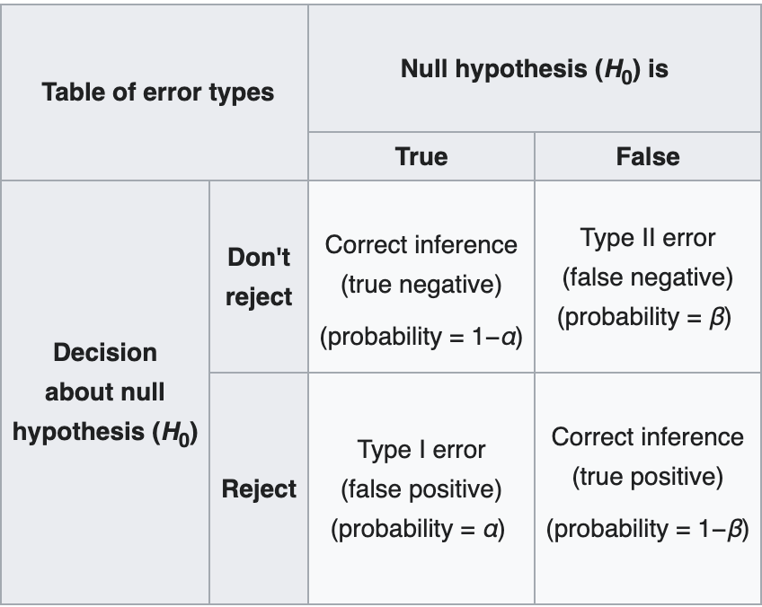

```{r setup, include=FALSE}
knitr::opts_chunk$set(echo = FALSE)
```

## Review

* Sampling Distribution

* Group discussion: if you are teaching sampling distribution to undergraduates in one of your sections, what do you want them to know? What would be most difficult to teach?

## Hypothesis

* Group discussion: What is a hypothesis? Could you give an example in one of your previous research?

## Null hypothesis and alternative hypothesis

* Null hypothesis and alternative hypothesis.

* Null hypothesis is the converse and negative proposition of the alternative 
hypothesis.

* Group activity: rewrite your previous hypothesis into a set of null hypothesis and alternative hypothesis. 

## The basic logic of hypothesis test

* Too rare to happen!
* If null hypothesis is true, we will have a certain sampling distribution for a statistics we choose. We can thus calculate the critical area of the sampling distribution, and test whether the parameter we calculated from the sample falls into it, thus decide whether we find a small probability event. 

## One-sample t-test

Suggest that $\mu_0$ is the value we want to test, the statistics we choose is T-score, which is defined as

$$
t = \frac{\bar{X}-\mu_0}{s/\sqrt{n}}
$$
When n is small, T score is distributed in a student t distribution with n-1 freedom. When n is large, it is normally distributed N(0;1). 

## Group Activities

Scenario: you landed on a small island with 1000 population. The tourist guide tells you that this island has a average month income of 1500 dollors. However, you became suspicious about it because when you bought a Coca Cola in the supermarket, you paid 3 dollars. Although there is a possibility that because of the transportation cost, Cola is generally more expensive, you decided to sample 30 local people on the street to answer your doubt. 

## Group Activities

* Task 1: Write out the null hypothesis and the alternative hypothesis.
* Task 2: Simulate a t statistics sampling distribution, and test whether the t statistics of the sample falls in the distribution.
* Task 3: Calculated the t distribution using the student t distribution table or function in R, compare the two results.


## Two independent sample t test

Using a similar formula, and the degree of freedom is the sum of the sizes of two samples. 

## Hypothesis test and Falsifiability

* It is a common misunderstanding that hypothesis test is related to falsifiability. 
* Failing to reject $H_0$ does NOT mean we have proven that $H_1$ is wrong. It is only saying: we do not find evidence strong enough to support this argument.

## Types of Error 

* Type I error False Positive
* Type II error False Negative
* Confusion Matrix

## Types of error
{width=70%}

## Group discussion

* COVID test as an example: suggest that there is a COVID test with type 1 error of 5% and type 2 error of 5%. You took the test and report negative, what is the probability of the true negative?

## Review

* T test can be expanded into different form: in slope, in two-independent sample etc. 
* There are other statistics, following other kinds of distributions. 
* You do not need to understand every math behind every test, live with its logic. 


