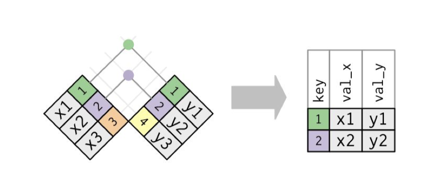

```{r setup, include=FALSE}
knitr::opts_chunk$set(echo = FALSE)
```

## When should I merge data sets?

In some cases, the data set you work with do not have some information you are looking for. In these scenarios, you might need to merge data sets to get related information.

We call this data merging or data joining.

## Some Examples

For example: 

* In a data set about education experience, you need to add school context into the individual level data, either on the school level, or the school district level, or even the county level.

* In a data set about labour market, you want to add job market situation data on the county or city level to model individual level data.

* You are interested in the relationship between economic development and labour unrest. There is one data set about economic development you got from the world bank, and an other data set about the labour unrest from another organization. 

## The key to the merging problem

Before we got into the technical details, think of a perfect data that you can use for your project. 

Key: you need what we call "key" to tell the program which two points should get together.

A "key" is a common column in the both data sets you are going to merge. Depend on your theoretical question, this key will vary. Example: FIPS code, year, country name, etc.

## Different types of merging (When we do not have duplicated keys)

The simplest one: inner join



## Other types

Depending on how you are going to preserve data, we can distinguish the following types of merging

{width=40%}

## Duplicated keys

m:1 or 1:m? This is also a theoretical question. 


