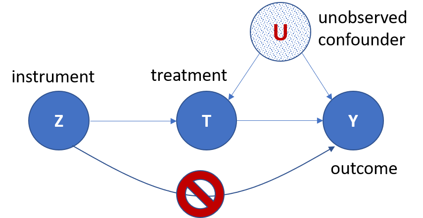
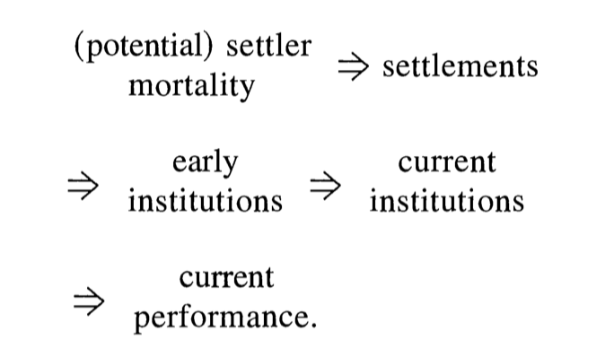
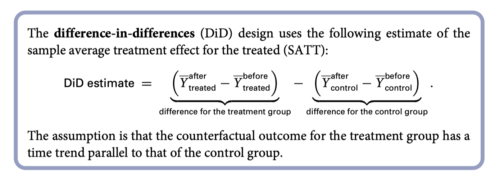
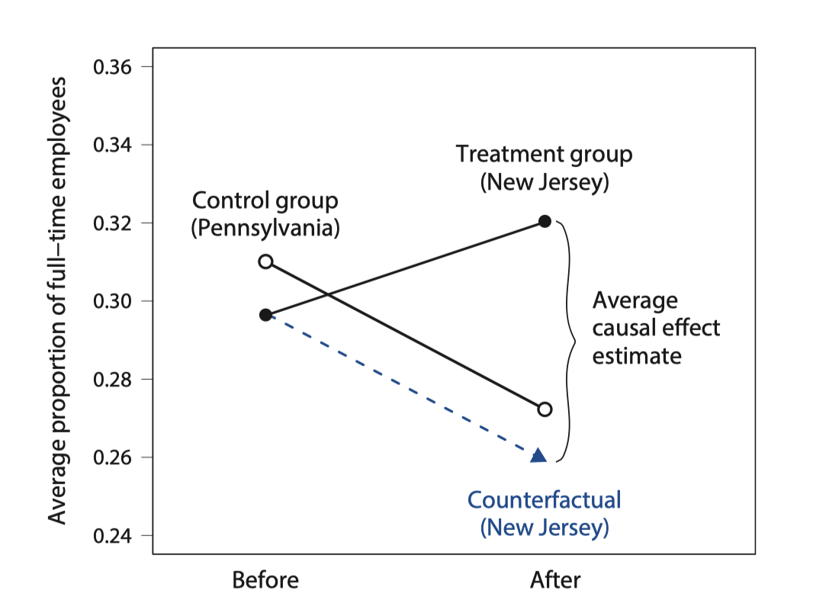
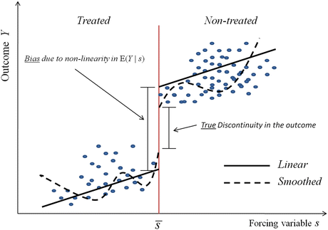
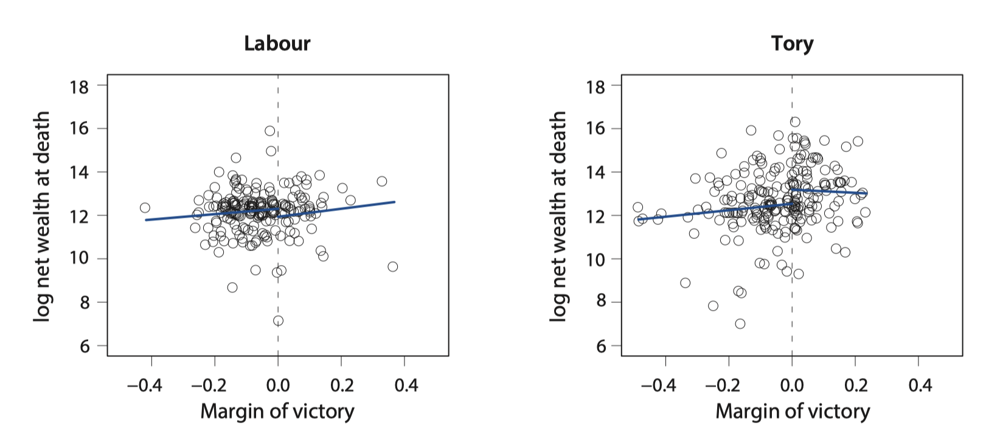

```{r setup, include=FALSE}
knitr::opts_chunk$set(echo = FALSE)
```

## Why We Need Casual Inference?

One cliche that we hear very often is that "correlation is not causation." But 
when can we say that we find a causation out of a statistical relation? 

Causal inference is a formal/statistical way to single out the causal relation 
out of the statistical relation.

It is different from the statistical inference we talked about previously.

## Two Schools of Causal Inference

There are two schools in causal inference, one is developed by Don Rubin and 
the other is developed by Judea Pearl, each with different emphases and 
frameworks.

Causal inference is heavily used in economics and political science, and to a 
less extent in sociology. 

## Outline

These two schools of causal inference are equivalent mathematically speaking. 
You can choose either to begin with. 

I will try to have a light introduction to Rubin's approach today. We won't talk 
much about the mathematical details of the causal inference, but more on the 
intuitions behind different techniques.

+ What is counterfactual reasoning?

+ Treatment effect and RCT

+ Semi-experiment designs

## Counterfactual and the Task of Causal Inference

Causal inference is a comparison between the factual (i.e., what actually 
happened) and the counterfactual (i.e., what would have happened if a key 
condition were different).

Example: At a given time point, Your understanding of statistics without taking 
any class V.S. Your understanding of statistics after taking a certain class. 

We define the difference between these two statuses as the treatment effect, and 
the difference in the key condition as a treatment. 

However, we observe only one of the two potential outcomes. You either have 
taken a course at time A or you have not taken it. 

## Randomness is the Key

Although we can not observe the treatment effect in a single observation, we are 
able to observe it a larger scale. 

If we randomly assign people into the treatment group or control group, the two 
groups are mostly homogeneous and statistically you can prove that the average 
difference in outcome between the treatment group and the control group can be 
attributed solely to the treatment. 

Notes: there are many other preconditions as well. The most important one is 
stable unit treatment value assumption, that is, the treatment only affects the 
treated unit.

## Golden Standard and Its Challenge

In theory, random control experiment or random control trial is the golden 
standard in the causal inference, not only in academics, but also in the 
industry.

However, design and implement a random control experiment in social science 
research are very very difficult. You need a lot of resources to do so, and also 
some topics are almost not possible to experiment on. 

In a lot of cases, we need to use observational data, the data that we are 
familiar with (like GSS), to approximate a experiment setting.

## Instrumental Variable (IV)

The first is instrumental variable (IV). IV is a way that we can get a less 
biased result when the intervention (treatment) is not as randomly assigned as 
we might think (for example, a unobserved factor influence the final outcome 
and the treatment at the same time.)

{width=60%}

## Example of IV

Acemoglu 2001: Using the death rate in early settler mortality as a IV for the 
type of early institutions, and further test the relation between the current 
institutions and economic performance. 

{width=80%}

## Difference in Differences (DID)

Intuition: we can observe similar trends among units if a treatment have not 
happened. 

DID design needs panel data, and is not able to deal with time-varying 
confounders

{width=80%}


## Example of DID

Card and Krueger 1994: In 1992, the state of New Jersey (NJ) raised the minimum 
wage from $4.25 to $5.05 per hour. Did such an increase in the minimum wage 
reduce employment as economic theory predicts?

{width=55%}

## Regression Discontinuity (RD)

In our social life, we always have some clear-cut lines used as criteria. This 
criteria will determine whether one receives treatment or not. We assume that 
whether people fall near such lines is mere a matter of luck, thus among this 
group of people, the treatment can be seen as randomly assigned. 

## Regression Discontinuity (RD)

If a treatment effect exists, we will see a jump or discontinuity around that 
line. Here we only introduce what is called sharp RD.  

We can further use regression to predict the average on each side of the cutting 
line and estimate the difference. 

{width=60%}

## Example of RD

Eggers and Hainmueller 2009: how much can politicians increase their personal 
wealth due to holding office?

{width=90%}

## Matching

Matching is a way to approximate a experiment design by match the observations 
from the control group to the treatment group according to a series of variables 
that might have theoretical interests. It will produce a more balanced sample 
so that pre-treatment conditions will be better controlled. 

There are multiple approaches to the matching. One thing you need to 
check before you conduct matching is that whether propensity score matching is 
suitable for your specific case. 

## The Antidotes from Sociologists

Casuality in the causal inference, whether it is from experiment or 
quasi-experiment, is generate by the research design. But casuality can still 
be identified by using theory, where Pearl's approach can be helpful.

More importantly, treatment-effect is only one kind of the causal relations 
that sociologists are interested in. 

Ermakoff, Ivan. 2019. “Causality and History: Modes of Causal Investigation in Historical Social Sciences.” Annual Review of Sociology 45(1):null. doi: 10.1146/annurev-soc-073117-041140.

Hirschman, Daniel, and Isaac Ariail Reed. 2014. “Formation Stories and Causality in Sociology.” Sociological Theory 32(4):259–82.

## Further Resources

Angrist, Joshua D., and Jörn-Steffen Pischke. 2008. Mostly Harmless Econometrics: An Empiricist’s Companion. Princeton University Press.

Anon. n.d. “Resolving Disputes between J. Pearl and D. Rubin on Causal Inference « Statistical Modeling, Causal Inference, and Social Science.” Retrieved May 22, 2021 (https://statmodeling.stat.columbia.edu/2009/07/05/disputes_about/).

Imai, Kosuke. 2018. Quantitative Social Science: An Introduction. Princeton University Press.

Morgan, Stephen L., and Christopher Winship. 2015. Counterfactuals and Causal Inference. Cambridge University Press.

Pearl, Judea, and Dana Mackenzie. 2018. The Book of Why: The New Science of Cause and Effect. Basic Books.


